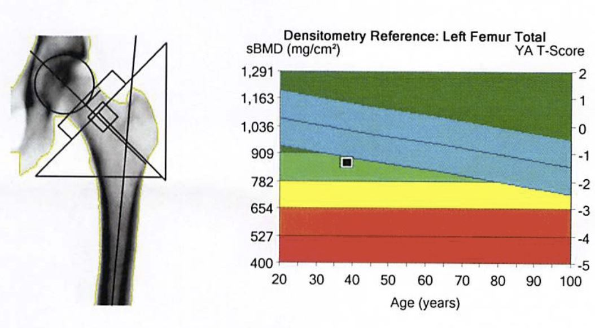
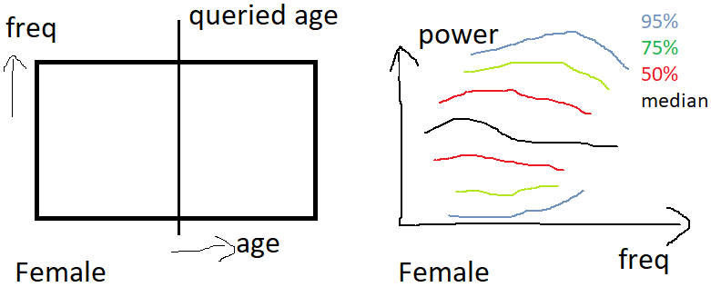
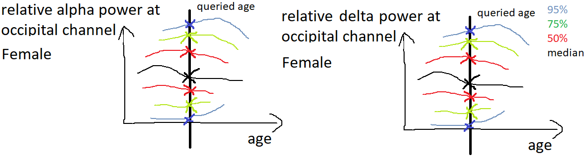
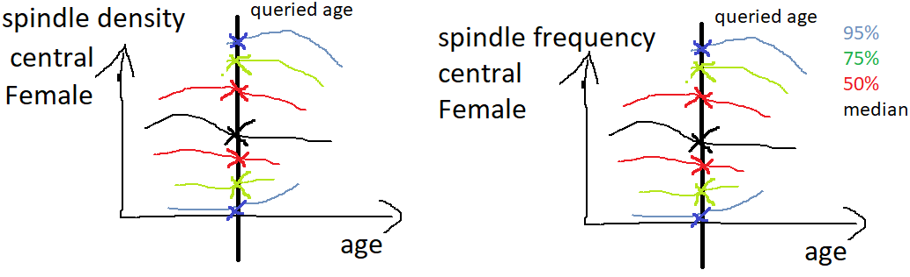

# Goal

A public website that
1. visualizes the age-dependent sleep EEG spectrum, relative band power, spindle density / duration / frequency;
2. has the ability to zoom in, especially for < 3 years; and
3. has the ability to upload sleep EEG file(s), either with integrated annotation of sleep stages (EDF+), or separate annotation (EDF & CSV/TXT/excel), compute the features, and display them in the age-dependent plots.

Optional: A publication in [Data in Brief](https://www.sciencedirect.com/journal/data-in-brief).

# Examples

Example 1: Bone age\


Example 2: [Brain MRI growth chart](https://brainchart.shinyapps.io/brainchart/)\
Bethlehem, Richard AI, et al. "Brain charts for the human lifespan." *Nature* 604.7906 (2022): 525-533.

# Data source for the age-dependent data

Note: Only use age $\le$ 80 years old.

### Age-dependent sleep EEG spectrum
```python
import pickle
suffix = '_frontal' # or ''
with open(f'spectra_age_norm_nn{suffix}.pickle', 'rb') as f:
    specs, spec_stds, freq, ages = pickle.load(f)
```
* `specs`: type=dict. key = ('F' or 'C' or 'O', 'W' or 'N1' or 'N2' or 'N3' or 'R', 0 or 1) where 0 is female and 1 is male; value = numpy.ndarray with shape (#age, #freq), representing the mean of power spectral density in dB/Hz (10log<sub>10</sub>$\mu$V<sup>2</sup>/Hz).
* `spec_stds`: type=dict, its structure is the same as `specs`, representing the standard deviation of power spectral density in dB/Hz.
* `freq`: type=numpy.ndarray, shape = (#freq,), representing the frequency bins.
* `ages`: type=numpy.ndarray, shape = (#age,), representing the age bins, where the interval is smaller for younger ages.

Example output:


### Age-dependent relative band power

```python
import pickle
bp_type = 'relative'
with open(f'bandpowers_age_norm_{bp_type}.pickle', 'rb') as f:
    bp_info = pickle.load(f)
```
* `bp_info`: type=dict. key = ('W' or 'N1' or 'N2' or 'N3' or 'R', 'F' or 'M', 'delta' or 'theta' or 'alpha' or 'sigma') , value is a list of 4 elements 
	1. age-dependent table: pandas.DataFrame, columns = [age, 2.5%, 12.5%, 25%, 50%, 75%, 87.5%, 97.5%, age_norm (do not use)]
	2. ages that generate the table, numpy.ndarray, shape = (#sample,)
	3. band powers that generate the table, numpy.ndarray, shape = (#sample,)
	4. subject IDs that generate the table, numpy.ndarray, shape = (#sample,)

Note, delta, theta, and sigma band powers are from the central channel, and alpha is from the occipital channel.\
Note, `bp_type` can also be 'absolute' for absolute band powers, but it may not be very generalizable.

Example output:


### Age-dependent spindle features

```python
import pickle
suffix = '_frontal' # or ''
with open(f'spindle_age_norm{suffix}.pickle', 'rb') as f:
    sp_info = pickle.load(f)
```
* `sp_info`: type=dict. key = ('F' or 'M', 'spindle_freq' or 'spindle_density' or 'spindle_duration' or 'spindle_amplitude' (do not use)) , value is a list of 3 elements 
	1. age-dependent table: pandas.DataFrame, columns = [age, 2.5%, 12.5%, 25%, 50%, 75%, 87.5%, 97.5%]
	2. ages that generate the table, numpy.ndarray, shape = (#sample,)
	3. spindle features that generate the table, numpy.ndarray, shape = (#sample,)

Note, spindles are from N2 stage only.

Example output:


# Code for extracting features from sleep EEG

<mark>**TODO**</mark>

# Hosting the website

Options:
* GitHub Pages
* R Shiny Server, if using R
* Alek's personal website: https://awestover.github.io/
* Haoqi's personal website: https://scholar.harvard.edu/sunhaoqi or https://hockey86.github.io/
